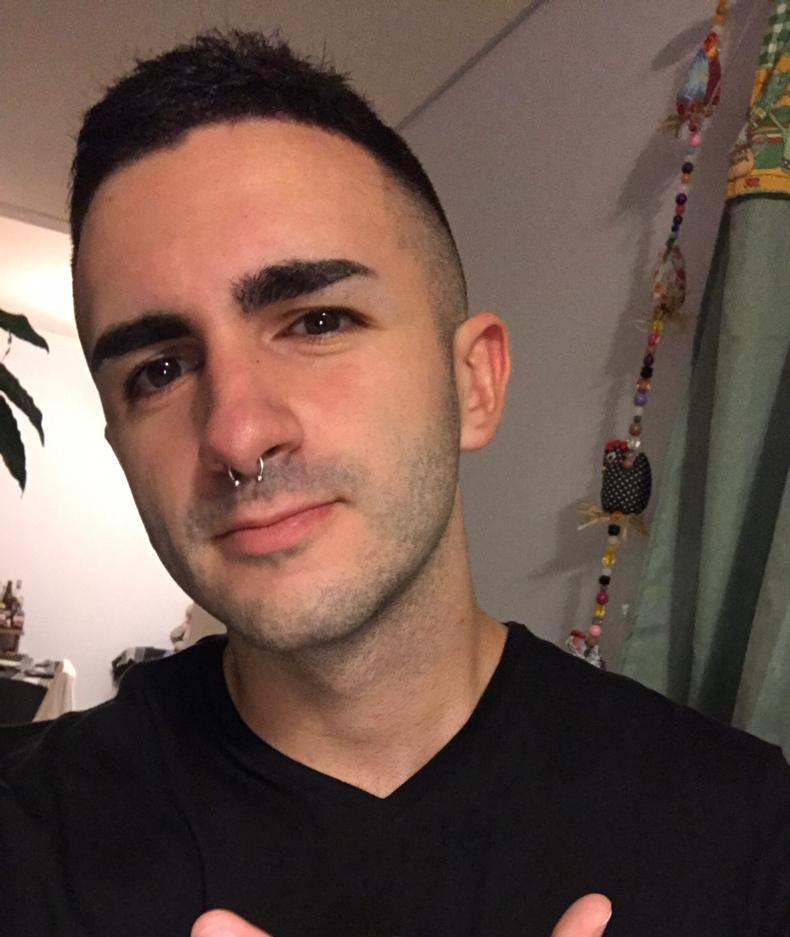
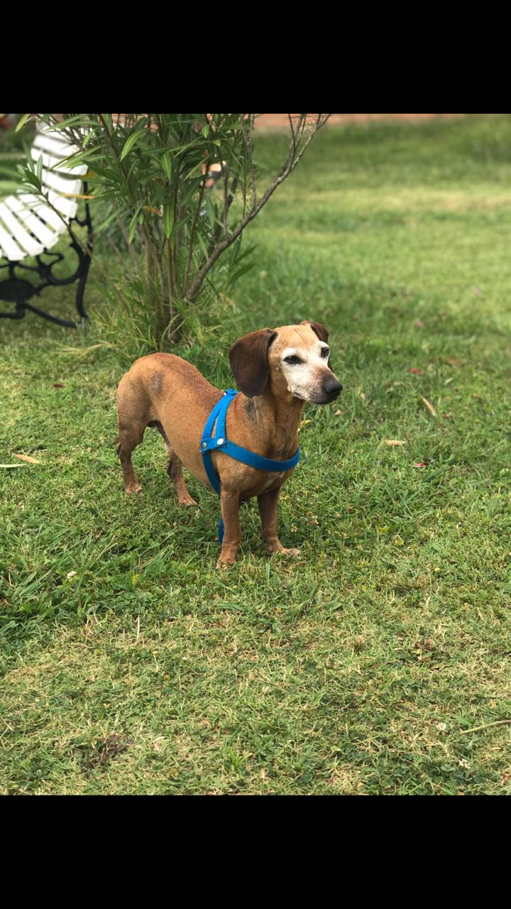

<h1>Guido Leonel Contartese</h1>
<h2>Legajo 171.520-3</h2>
<h2>Llego el momento de contarles un poco sobre mi</h2>

Buenas tardes, para empezar no tengo ningun apodo ni nada por el estilo, simplemente llamenme guido. 
Tengo 20 años, vivo en capital federal en el barrio de mataderos, este es mi segundo año de cursada en la carrera, con errores y aprendizajes pero siguiendo al pie del cañon. Soy egresado de una escuela tecnica en electrónica, pero al ver mis dos unicas materias de programación en la secundaria, descubrí que esta sería (o eso creo) la carrera que deseo seguir. Tengo conocimientos de C aprendidos en el secundario, y de C++ 
por la materia de algoritmos y estructura de datos. No queria olvidar la parte que tengo un perro salchicha de 13 años, llamado Cleto, y aunque les parezca viejo, sigue jugando y teniendo la vitalidad de uno joven... Me podria considerar un fanatico de dicha raza. 
Les dejo mis redes sociales por si alguno quiere chusmear <a href="https://www.instagram.com/guidocontartese/">Instagram</a> y <a href="https://twitter.com/ContarteseGuido">Twitter</a>. 

<h2>Hobbys</h2>

La verdad que no soy una persona que tenga algun hobby en especial, suelo mirar muchas series, 
jugar al league of legends cuando tengo algun tiempo libre (aunque ya no tanto porque termino 
muy enrroscado) y al fifa. 
Casi lo olvidaba me considero un fanatico de las peliculas de ciencia ficcion y suspenso. 
- Star Wars. 
- El señor de los anillos. 
- Cuando las luces se apagan.

<h2>Por ultimo les dejo mi foto y una de mi perro ya que lo nombre</h2>

